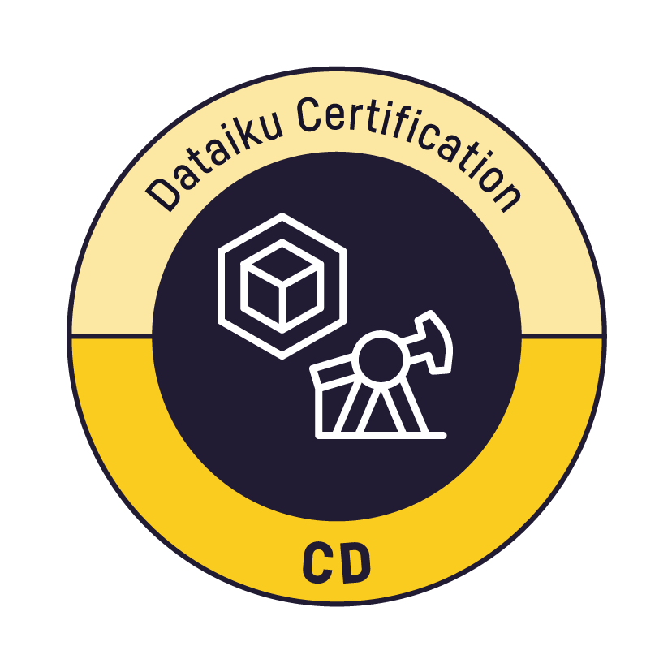

<h1 align="center">Pranav Balachander</h1>

  
  
  
  

---

## About

Hey, I'm Pranav, a Computer Science graduate from Penn State with experience in AI, data analytics, and software development. I'm passionate about applying technology to solve challenges across business and healthcare.

📧 **p.pranavbalachander@gmail.com**

---

## Tech Stack

### Languages

### Frameworks & Libraries

### AI / ML & Data

### Databases

### Tools

---

## Certifications

  
  
  
  
  

---

## Featured Projects

### 📈 UniElecPrice

IEEE-published unified day-ahead electricity-price dataset spanning 40 markets, featuring a CNN–BiLSTM–Attention forecasting model that outperformed LSTM and Transformer baselines.

### 🤖 SponsorScan

AI-powered job aggregation platform that automatically collects, filters, and ranks software engineering jobs for OPT and H-1B candidates using intelligent work-authorization and experience-based filtering.

### 🥽 VALS

Virtual reality anatomy labeling system built in Unity and C#, featuring Trie-based autocomplete for fast and intuitive in-headset interaction.

### 🚘 commutr

Student commuting platform focused on simplifying transportation through user-centered design, accessibility, and route planning.

---

## Publication

**Unified Cross-Regional Time-Series Day-Ahead Electricity Price Dataset (UniElecPrice)**

Accepted to **IEEE Data Descriptions (2025)**

🔗 https://ieeexplore.ieee.org/document/11169754

🔗 https://doi.org/10.1109/IEEEDATA.2025.3609683
